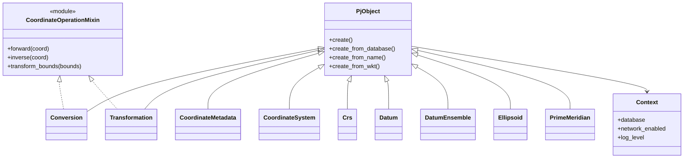

# Class Hierarchy

The proj4rb class hierarchy is based on Proj's class hierarchy, which is derived from the [OGC Abstract Specification](http://docs.opengeospatial.org/as/18-005r5/18-005r5.html).



## PjObject Properties

All `PjObject` subclasses expose common metadata:

```ruby
crs = Proj::Crs.new('EPSG:4326')

crs.name          #=> "WGS 84"
crs.auth_name     #=> "EPSG"
crs.id_code       #=> "4326"
crs.auth          #=> "EPSG:4326"
crs.proj_type     #=> :PJ_TYPE_GEOGRAPHIC_2D_CRS
crs.remarks
crs.scope
crs.deprecated?   #=> false

area = crs.area_of_use
area.name
area.west_lon_degree
area.south_lat_degree
area.east_lon_degree
area.north_lat_degree
```

## Supporting Classes

`Area`, `Bounds`, `Bounds3d`, `Coordinate`, `Context`, `Database`, `GridCache`, `Operation`, `OperationFactoryContext`, `Parameter`, `Session`, `Unit`
