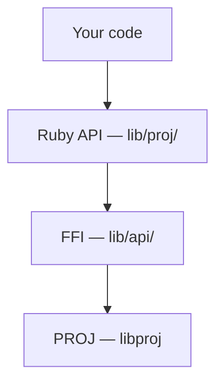

# ruby-bindgen and FFI Bindings

proj4rb talks to the PROJ C library through [Ruby FFI](https://github.com/ffi/ffi), removing the need to create a compiled C extension. The FFI function signatures are auto-generated by [ruby-bindgen](https://github.com/cfis/ruby-bindgen), which reads the PROJ C headers and produces Ruby code. On top of that generated layer are hand written Ruby classes to provide a more natural, object-oriented API you use day-to-day.

## Architecture

The binding stack has three layers:



**`lib/api/`** — Auto-generated by ruby-bindgen. Contains FFI struct definitions, enum mappings, and `attach_function` calls that map Ruby methods to C functions. Do not hand-edit these files (they include a header comment indicating they are generated).

**`lib/api/proj_version.rb`** — The one hand-maintained file in `lib/api/`. It detects the installed PROJ version at runtime by calling `proj_info()` and sets `PROJ_VERSION`, which the generated files use for version guards.

**`lib/proj/`** — Hand-written Ruby classes (~36 files) that wrap the raw FFI calls into an idiomatic Ruby API. This is where `Crs`, `Transformation`, `Context`, and the rest of the public interface live.

## Version Guards

PROJ adds new C functions with each release. ruby-bindgen wraps each group of functions in a version check so the gem works with older PROJ installs:

```ruby
# Auto-generated in lib/api/proj.rb
if proj_version >= 90600
  attach_function :proj_trans_bounds_3D, ...
end
```

The version groups are defined in `ffi-bindings.yaml` under `symbols.versions`. Each key is an integer encoding of the PROJ version (major × 10000 + minor × 100 + patch) and the value is a list of C function names introduced in that release.

## ffi-bindings.yaml

This YAML file is the single source of truth that drives code generation. See the [ruby-bindgen configuration reference](https://ruby-rice.github.io/ruby-bindgen/configuration/) for the full list of supported options.

The proj4rb-specific things to know:

- **`symbols.skip`** — `proj_info` and `PJ_INFO` are excluded because they live in the hand-maintained `proj_version.rb`.
- **`symbols.versions`** — Each key is an integer-encoded PROJ version (major × 10000 + minor × 100 + patch) mapping to the C functions introduced in that release. This is what drives the version guards.
- **`symbols.overrides`** — Manual signature corrections for cases where auto-detection gets it wrong: `:bool` returns (Ruby's `0` is truthy), `:size_t` parameters (different size than `:ulong` on 64-bit Windows), buffer pointers, and struct array parameters.

## Generated Files

| File | Contents |
|---|---|
| `lib/api/proj_ffi.rb` | Preamble: loads the shared library, then requires the other files |
| `lib/api/proj.rb` | Bindings for `proj.h` — structs, enums, and `attach_function` calls |
| `lib/api/proj_experimental.rb` | Bindings for `proj_experimental.h` |
| `lib/api/proj_version.rb` | Hand-maintained — runtime PROJ version detection |

## Regenerating Bindings

Install [ruby-bindgen](https://github.com/cfis/ruby-bindgen), then run:

```console
ruby-bindgen ffi-bindings.yaml
```

This re-parses the PROJ C headers on your system and regenerates the three auto-generated files in `lib/api/`. The hand-maintained `proj_version.rb` is never overwritten.

Regenerate when you:

- Add support for a new PROJ version (add a `symbols.versions` block)
- Add or change function overrides
- Update to a newer PROJ system install with new headers

## Adding Support for a New PROJ Release

1. Install the new PROJ version so its headers are available.
2. Add a new version block to `symbols.versions` in `ffi-bindings.yaml` listing the new C functions.
3. Add any needed signature overrides.
4. Run `ruby-bindgen ffi-bindings.yaml`.
5. Write Ruby wrapper code in `lib/proj/` for the new functionality.
6. Add tests.
